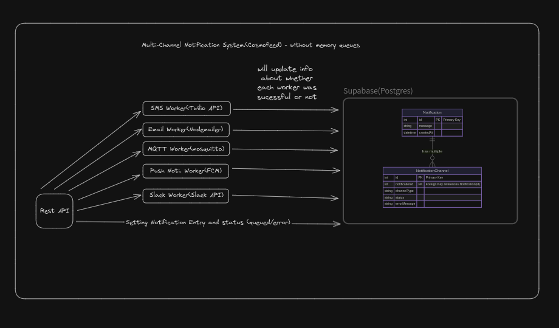
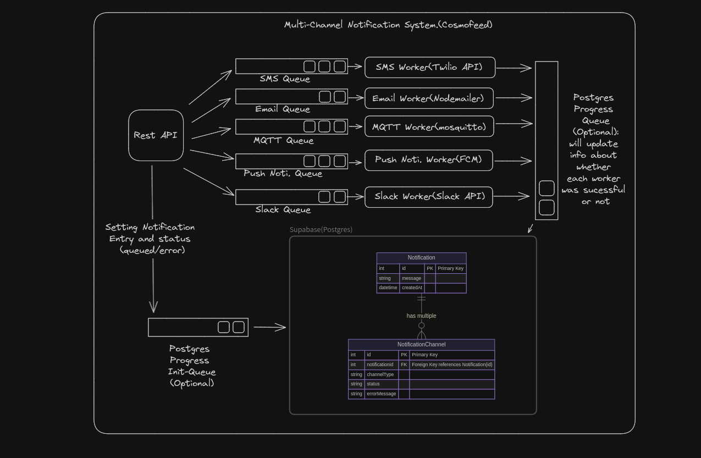
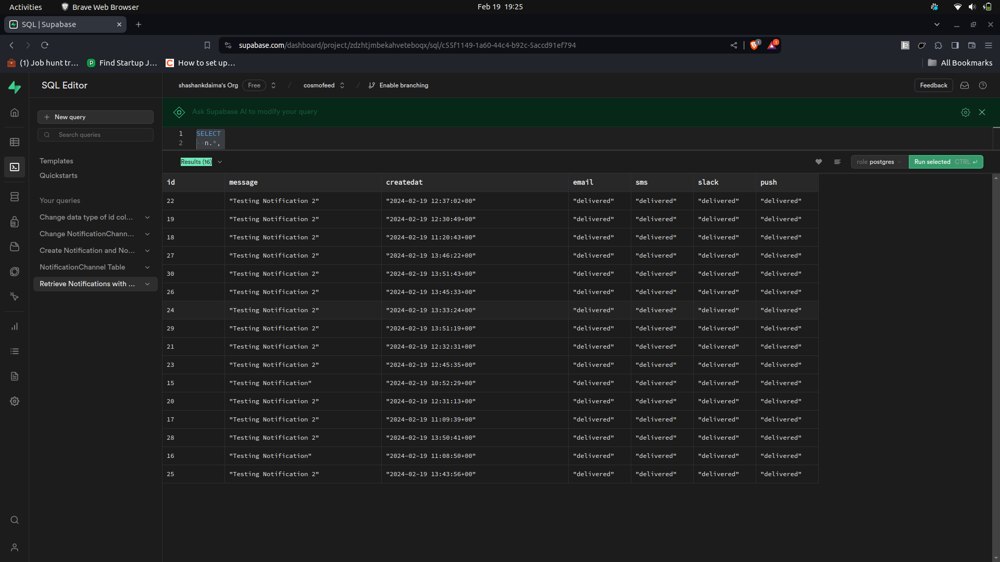

# MultiChannel Notification System


This is a scalable MultiChannel Notification System that sends notifications to SMS, EMail, Push Notification, Slack, and MQTT. This is a hiring assignment for a Senior Software Engineer at Cosmofeed. The system is built with Express.js and TypeScript.
> **Note:** The MQTT functionality is currently not working. We are actively working on fixing this issue. Thank you for your understanding.
> **Push Notification Client**: Please download the apk attached `push-notification-client` folder





https://github.com/shashankdaima/cosmofeed/assets/64317542/80ef2e50-1a44-40b3-a474-98c1cd625afc

## Tech Stack
- Express.js (with Typescript)
- Supabase
- Firebase (for FCM)
- Google OAuth (for email with Nodemailer)
- Slack API


## Future Improvements
- Fix the MQTT pipeline to enable MQTT functionality.
- Writing Unit test with Jest.
- Add a message queue to avoid data congestion.

## API Curl Definition
> **Note:** This service is deployed on Render.com's free tier. Hence, initial request will take about a minute to spin up the server.  
```bash
curl --location 'https://cosmofeed-trial.onrender.com/notification/dispatch' \
--header 'Content-Type: application/json' \
--data-raw '{
    "type": "*",
    "message":"Testing Notification 2",
    "emailChannel": {
        "type": "email",
        "body": "Helloworld",
        "subject": "Email Notification Service:2",
        "recipients": [
            "shashank19106@iiitd.ac.in",
            "shashankdaima@proton.me"
        ]
    },
    "pushChannel": {
        "type": "push",
        "recipients": [
            "fadrugxlQMOcgKTjbv88ej:APA91bG3cHS_bSDC_FAAnrgJCEGZC1f-STwv6lBAfL7ba-UFVZQNR3kRIQOsTVjdZGLEbFw1poQn0Q9ogvvf7VzT_UBOOzI1hauvurb57JMOM8cyZi22tv1MRayPDbFUOCmyIil5V2Np"
        ],
        "title": "Push Notification Service:2",
        "body": "Helloworld"
    },
    "smsChannel": {
        "type": "SMS",
        "recipients": [
            "+91<phone number>"
        ],
        "message": "SMS Notification Service:2"
    },
    "mqttChannel": {
        "type": "MQTT",
        "topic": "Mqtt Notification Service:2",
        "message": "Helloworld"
    },
    "slackChannel": {
        "type": "slack",
        "channel": "#testing",
        "message": "Slack Notification Service:2"
    }
}'
```
## Individual Platform Integration Info.
Because most of the platform have some sort of authentication, it's a important step to setup individual channels apart from SDK's(and library keys). If you have correct keys as enviroment variables.
- Push notification: Download apk given this project, it has integration with FCM, click on "Copy Token", it will copy fcm token to your clipboard, then add that to recipents. Thanks to Philipp Lackner's tutorial on FCM. I just took his app with my google_services.json. 
- Slack Notifications: There is a bot(I named it "Cosmofeed Slack Bot") you need to include that bot in your project. 
- Email: Nothing. It will work by default. 
- Phone number nothing. It will work. 
- MQTT not working as of now. 

## How to monitor each individual notification progress?

We are storing each statuses of each notification separately in a Postgres database(currently hosted on supabase servers). We can query this db with following query. (or could use ORMs like Prisma for quering. I choose to stick with writing raw SQL queries.)
```sql
SELECT
  n.*,
  MAX(
    CASE
      WHEN nc.channeltype = 'Email' THEN nc.status
    END
  ) AS Email,
  MAX(
    CASE
      WHEN nc.channeltype = 'SMS' THEN nc.status
    END
  ) AS SMS,
  MAX(
    CASE
      WHEN nc.channeltype = 'Slack' THEN nc.status
    END
  ) AS Slack,
  MAX(
    CASE
      WHEN nc.channeltype = 'Push' THEN nc.status
    END
  ) AS Push
FROM
  notification n
  LEFT JOIN notificationchannel nc ON n.id = nc.notificationId
GROUP BY
  n.id;

```  

## System Overview
The system is designed to handle a large number of notifications across multiple channels. It is built with scalability and reliability in mind. The current implementation supports SMS, EMail, Push Notification, and Slack. The MQTT functionality is a work in progress. Each individual notification service should have its own messaging queue, allowing us to increase or decrease the number of workers as per the load of the message queue.
## What's Next?
The first priority is to fix the MQTT pipeline and enable MQTT functionality. This will allow the system to support real-time messaging over MQTT. Additionally, the system can be further improved by adding a message queue. This will ensure that no notifications are lost, even during high traffic periods.

## Thank You
Thank you for considering this assignment. I look forward to discussing the system in more detail.

