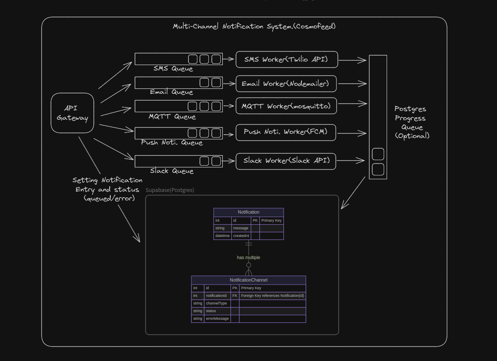

# Scalable MultiChannel Notification System


This is a scalable MultiChannel Notification System that sends notifications to SMS, EMail, Push Notification, Slack, and MQTT. This is a hiring assignment for a Senior Software Engineer at Cosmofeed. The system is built with Express.js and TypeScript.
> **Note:** The MQTT functionality is currently not working. We are actively working on fixing this issue. Thank you for your understanding.


## Tech Stack
- Express.js
- Supabase
- Firebase (for FCM)
- Google OAuth (for email with Nodemailer)
- Slack API
- BullMQ


## Future Improvements
- Fix the MQTT pipeline to enable MQTT functionality.
- Add a message queue for better scalability and reliability.
- Maybe usage of Kubernetes for orchestration

## API Curl Definition
```bash
# Insert API Curl Definition Here
```

## System Overview
The system is designed to handle a large number of notifications across multiple channels. It is built with scalability and reliability in mind. The current implementation supports SMS, EMail, Push Notification, and Slack. The MQTT functionality is a work in progress. Each individual notification service has its own messaging queue, allowing us to increase or decrease the number of workers as per the load of the message queue.
## What's Next?
The first priority is to fix the MQTT pipeline and enable MQTT functionality. This will allow the system to support real-time messaging over MQTT. Additionally, the system can be further improved by adding a message queue. This will ensure that no notifications are lost, even during high traffic periods.

## Thank You
Thank you for considering this assignment. I look forward to discussing the system in more detail.

